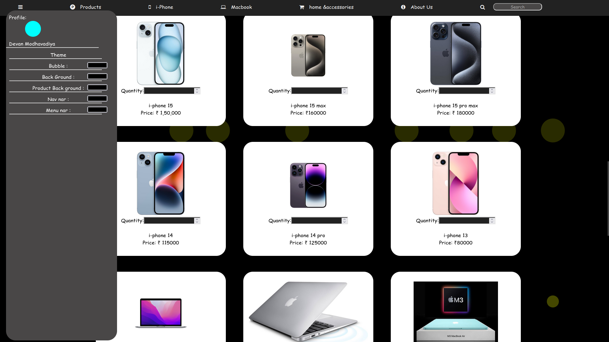

# Apple Store – Demo Web Project

This is a front-end demonstration project built using HTML, CSS, and JavaScript. The project simulates a basic Apple Store experience with a focus on layout, styling, and simple interactivity. It was created for educational purposes and is not intended for production use.

## Features

- Welcome animation and splash screen
- Interactive product display with categories like iPhones, MacBooks, and accessories
- Color theme customization for the UI
- Order functionality to input quantity and view a generated bill
- Sliding banner for featured images
- Static user login form (no backend)

## Technologies Used

- HTML5
- CSS3 (Animations and Transitions)
- JavaScript (DOM and jQuery)
- Font Awesome Icons

## Screenshots

### Welcome Screen
Displays a splash animation before entering the store interface.  

### Product Showcase
All Apple products grouped by type with quantity input and pricing.  

### Login Page
Basic login form styled with animated background layers.  

### Theme Customization
Users can modify colors for various UI components in real-time.  

### Sliding Banner
Rotating product advertisements at the top of the page.  

## Known Limitations

- This project works best in **Google Chrome**.
- Not fully responsive; designed for desktop view only.

## How to Use

1. Download or clone the repository.
2. Open `main.html` or `index.html` in your web browser.
3. Interact with products, theme settings, and explore the interface.

## Note

This project is shared for demonstration and academic learning purposes only.

## Author

**Devan Modhavadiya**  
Email: modhavadiyadevan189@gmail.com
